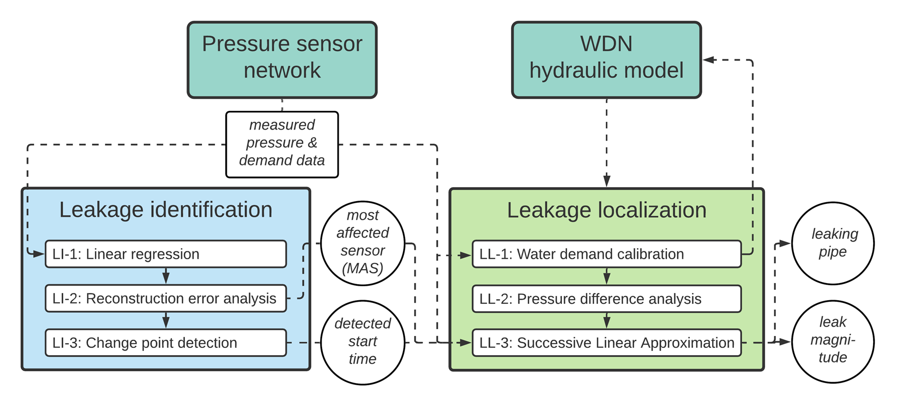

# LILA - A high-resolution pressure-driven Leakage Identification and Localization Algorithm
This repository contains the **Leakage Identification part** of LILA.

### Citation
If you use LILA, please consider citing our paper that describes it: 
```
Daniel et al. (forthcoming) "A sequential pressure-based algorithm for data-driven Leakage Identification 
and model-based Localization in water distribution networks" Journal of Water Resources Planning and Management.
```

### Authors
- [Ivo Daniel](https://www.swn.tu-berlin.de/menue/team/msc_ivo_daniel/), [Andrea Cominola](https://www.swn.tu-berlin.de/menue/team/prof_dr_andrea_cominola/) - [Chair of Smart Water Networks](https://swn.tu-berlin.de) at [Technische Universität Berlin](https://tu.berlin) and [Einstein Center Digital Future, Berlin](https://digital-future.berlin)  
- Simon Letzgus - [Machine Learning group](https://www.ml.tu-berlin.de/menue/machine_learning/) at [Technische Universität Berlin](https://tu.berlin)

### Organization of repository
LILA operates in a sequential way, represented in the following flowchart:

*source: underlying work (see section above)*

For leakage identification, the notebook in the folder 'LI' performs linear regression analysis and change point detection to provide the starting times of the leaks, and also provides the error trajectories,.

The further work performing localization is available at:
https://github.com/jorgeps86/LeakLocalization

Additionally, [_utils](_utils/) contains all data as well as functions used for data loading, helper classes, and the definitions of the functions used for change point detection.

### Dataset
The work in this repository is applied to the dataset of the BattLeDIM.  
(see information below)

### References
Related work:
- https://doi.org/10.5281/zenodo.3924632 (Version submitted to BattLeDIM)

Information on the BattLeDIM can be found at:
- https://battledim.ucy.ac.cy/ (Website hosted by comittee)
- https://zenodo.org/record/3902046 (Overview)
- https://zenodo.org/record/4017659#.X4mBaC2w1hE (Dataset)
- https://zenodo.org/record/4139603#.X8lAfbG5p04.mendeley (Competition results)

### LICENSE
Copyright (C) 2021 Ivo Daniel, Simon Letzgus, Andrea Cominola. Released under the [GNU General Public License v3.0](LICENSE). The code is distributed in the hope that it will be useful, but WITHOUT ANY WARRANTY; without even the implied warranty of MERCHANTABILITY or FITNESS FOR A PARTICULAR PURPOSE. See the GNU General Public License for more details. You should have received a copy of the GNU General Public License along with STREaM. If not, see http://www.gnu.org/licenses/licenses.en.html.
